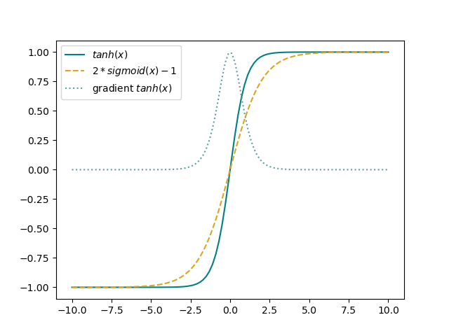
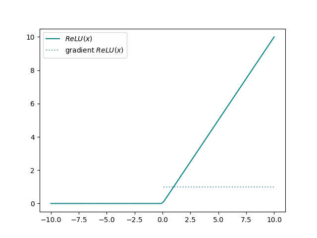
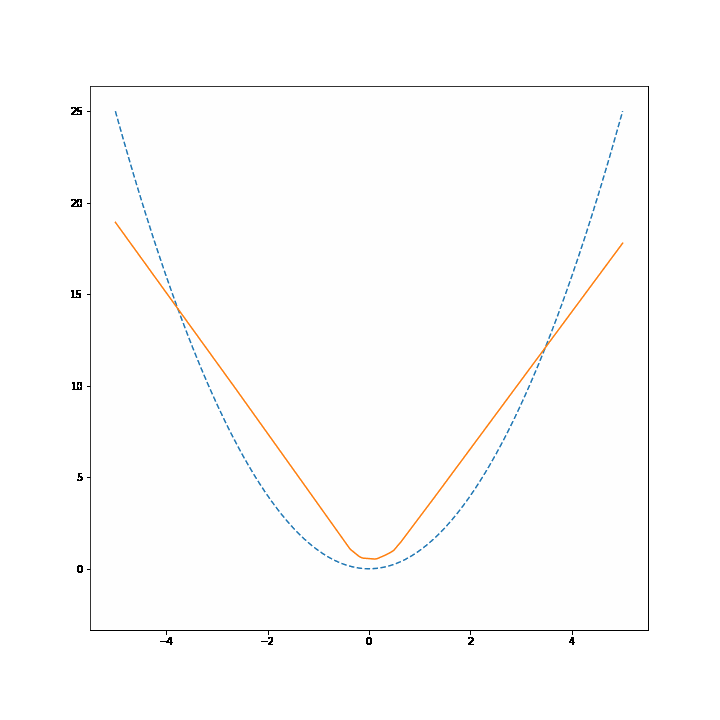

# An illustrated guide to ReLUs
A neural network is essentially a stack of functions that try to approximate an unknown goal function by adapting the weights in each layer. If you add more layers, you add more complexity and hence give the network the ability to learn more complex functions. Nevertheless, if you only stack linear functions on top of each other, the resulting function remains well, linear.\
$f(X) = W_1X + b_1$\
$g(X) = W_2X + b_2$\
$g(f(X)) = \underbrace{W_2W_1}_{W_3}X + \underbrace{W_2b_1 + b_2}_{b_3}$\
If we'd try to aproximate a quadratic function using only a linear layer, we'd end up with the training process looking something like this:
\
The direction of the gradient  jumps between the left and right tails of the quadratic function, without the network being able to settle for a suitable approximation.
Still, we like linear functions, they have a predictible gradient and are differentiable in all points. If you take a higher order polynomial for example, they tend to have dramatic tails when extrapolating data (imagine the behaviour of $x^2$ for values aproaching infinity).
  So this is where activation functions come into play: they allow the model to go beyond linearity by wrapping the linear functions in each layer with some non linear transformation.\
$a(f(x)) = a(W_1x +b)$

## Overview of common activation functions
So what are activation functions? Basically any function can be used as the activation, but some are more popular than others.
In this section we're going to go over some of the most commonly used activation functions, as well as a brief discussion of their advantages and flaws. Feel free to skip this section if you're already familiar.

### **Sigmoid**
$f(x) = \frac{1}{1+e^{-x}}$
\
The sigmoid maps to values between 0 and 1, which makes it a handy tool for predicting probabilities. As such, it is a popular pick when solving binary output classification problems and is usually used as the activation function before computing the binary cross entropy loss. A downside of the sigmoid is the so called vanishing gradient problem, which describes the small value range for which the function produces a notable gradient, localized around zero. 
### **tanh**
$f(x) = tanh(x)$
\
The tanh maps to values between -1 and 1, it is very similar to the sigmoid function but with the advantage of a higher gradient around 0. Nevertheless, it still poses no solution to the vanishing gradient problem.
### **ReLU**
$f(x) = max(0,x)$
\
The  Rectified Linear Unit maps values smaller then 0 to 0 and positive numbers stay the same. This allows for a much larger range of values for which the network receives a gradient, as the derivative is either 0 for values smaller or equal to 0, or 1. In comparison to the sigmoid or tanh, the magnitude of the gradient stays the same across all positive valued inputs.  
### **leaky ReLU**
$f(x;\alpha) = max(\alpha x,x)$
\
There are many derivations of the classical ReLU, with the leaky ReLU allowing for gradients for values below 0. This prevents dying neurons which can occur with classical ReLUs if all input values are below zero, so the neuron will never reveive any gradient.
## Why we use ReLUs
Now that we have introduced some of the most popular activation functions, as well as established the downsides of tanh and sigmoid, it's time to give some intuition on how ReLUs work. After all, it seems nice that we get a gradient and all, but *how* exactly do we approximate a function simply by setting all values smaller than zero to zero? The ReLU afterall doesn't look that far from the Linear function, right?
Well that's the beauty of it. The simplicity of the ReLU allows you to aproximate a function by glueing together *piecewise* linear functions.\
To give some intuition to this idea, we will observe a ReLU network solving a simple function, layer by layer.
### Example: Approximating $x^2$
We want to build a network that approximates the square function:\
$f(x)=x^2$\
With each layer in the network having the form\
$max(0,Wx+b)$\
If we start with a single Linear Layer with ReLU activation\
$l_1(x) = max(0,wx+b)$ with $w,b \in \mathbb{R} $\
 and visualize the training process, we can see the following behaviour: \
\
Clearly, the added ReLU is an improvement to a single linear function, nevertheless the network only manages to give a broad approximation for positive input values. This is not surprising, given that the ReLU only returns the positive values and sets everything else to 0. Overlooking the bias, the network can either handle all positive values, or all negative values (with $w_1<0$), but it cannot learn how to deal with both. So in order to give it the oppurtunity to deal with negative values as well as positive ones, we need another neuron:
:\
$l_1(x) = max(0,\mathbf{w}_1x+b_1)$ with $\mathbf{w}_1$, $b_1 \in \mathbb{R}^2$\
Finally, we need to combine the information of both neurons in single neuron:\
$l_2(x) = \mathbf{w}_2x+b_2$ with $\mathbf{w}^T_2 \in \mathbb{R}^2$, $b_2 \in \mathbb{R}$\
\
Looks much better, right?\
The first linear layer approximates the left and right tail of the quadratic function, the ReLU cuts the unnecessary values and finally, our last layer combines the two by simply adding them together.\
And this is how you can utilize linear layers and ReLUs to approximate complicated funtions, by allowing each neuron to focus on a just single section. We can of course add more neurons and more layers to get even crisper results. For our quadratic function, if we pump the number of neurons in the first layer up to 20, we'd end up with the final approximation looking something like this:\
\
This concludes our little tutorial, I hope you now have more of an intuition on how ReLU networks work. If you're interested in playing around with this setup yourself, take a look at my notebook ReLU_nets_visualized.ipynb.
 
